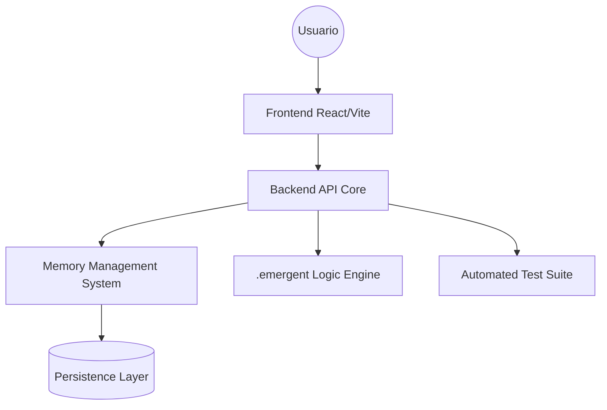

# 🤖 AUTOMATON: Framework de Agentes Emergentes

> **Sistemas de IA autónomos con memoria persistente y comportamientos emergentes.**

AUTOMATON es un ecosistema diseñado para la creación, prueba y despliegue de agentes de IA con capacidades de memoria a largo plazo y una estructura de micro-servicios modular. Su arquitectura permite que los agentes evolucionen y respondan a entornos complejos mediante una lógica "emergente".

---

## 🌟 Características Principales

- **Emergent Core**: Directorio especializado para comportamientos no lineales y respuestas adaptativas de agentes.
- **Persistent Memory**: Sistema de gestión de memoria diseñado para que los agentes retengan contexto entre sesiones.
- **Frontend & Backend Decoupled**: Arquitectura moderna con backend de servicios y frontend reactivo.
- **Hardening Técnico**: Documentación de guías de diseño (`design_guidelines.json`) y reportes de tests exhaustivos (`test_reports/`).

---

## 🏗️ Arquitectura del Framework



### Stack Tecnológico
- **Lógica**: Python (backend_test.py) y TypeScript.
- **Configuración**: Guías de diseño estructuradas en JSON.
- **Calidad**: Suite de tests automatizados con reportes detallados en Markdown.

---

## 🚦 Estado del Desarrollo

| Componente | Estado | Descripción |
| :--- | :--- | :--- |
| **Backend** | ✅ Estable | Motor de lógica y rutas de agentes. |
| **Frontend** | 🔄 En Progreso | Interfaz de monitorización de agentes. |
| **Memory System** | ✅ Estable | Capacidad de retención de contexto. |
| **Emergent Engine** | 🔄 Experimental | Lógica de comportamientos adaptativos. |

---

## 🚀 Futuras Mejoras & Sugerencias de IA

Basado en la estructura de `AUTOMATON`, se sugieren las siguientes evoluciones:

1.  **Orquestación de Memoria Semántica**: Implementar la skill `multi-agent-orchestrator` para gestionar el paso de contexto de la carpeta `memory/` a múltiples agentes simultáneos.
2.  **Visualización de Emergencia**: Usar `performance-profiler` para medir la latencia del motor `.emergent` y visualizar en el frontend los árboles de decisión de los agentes en tiempo real.
3.  **Auditoría de Comportamiento**: Activar `automated-test-oracle` para garantizar que los comportamientos emergentes no se desvíen de las guías de diseño definidas en `design_guidelines.json`.
4.  **Simulación de Entornos Hostiles**: Utilizar `synthetic-user-tester` para poner a prueba la resiliencia de los agentes ante entradas de usuario que intenten romper su lógica persistente.
5.  **Documentación Dinámica**: Emplear `readme-architect` para generar reportes automáticos de cada fase de "emergencia" detectada en los logs.

---

## 🚀 Instalación y Setup

1. **Backend**:
   ```bash
   python -m pip install -r requirements.txt
   python backend_test.py
   ```
2. **Frontend**:
   ```bash
   cd frontend
   npm install && npm run dev
   ```

---

© 2024 **iagorobo24-hub** | *Building autonomous emergent systems.*
