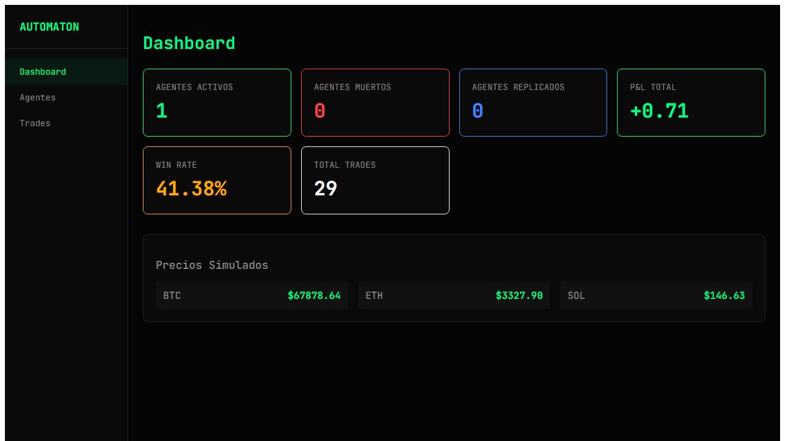
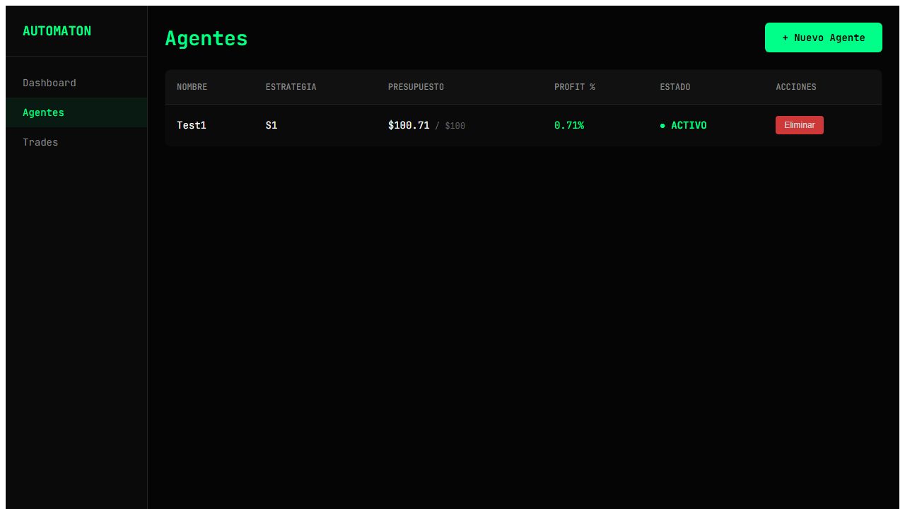
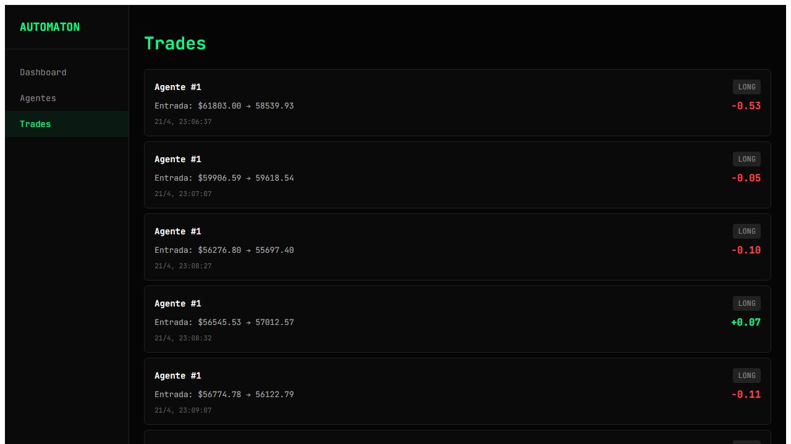

# 🤖 AUTOMATON v2

> **Agentes de trading crypto autónomos con estrategias de replicación.**

AUTOMATON v2 es un ecosistema de agentes de trading que operan de forma autónoma, ejecutan estrategias y se replican cuando alcanzan umbrales de profit.

👉 **[Ver Análisis Completo del Sistema y Documentación Visual](docs/ANALYSIS.md)**  
👉 **[Ver Arquitectura Técnica](docs/ARCHITECTURE.md)**  
👉 **[Ver Changelog](docs/CHANGELOG.md)**

---

## 🖼️ Visual Preview

<p align="center">
  
  
</p>
<p align="center">
  
</p>

---

## 🚀 Quick Start

```bash
# 1. Clonar el repositorio
git clone https://github.com/iagorobo24-hub/AUTOMATON.git
cd AUTOMATON

# 2. Instalar todas las dependencias (Node + Python)
npm install
npm run setup

# 3. Iniciar el sistema completo
npm run dev
```

El comando `npm run dev` inicia:
- 🟡 **BACKEND** (FastAPI) en http://127.0.0.1:8000
- 🔵 **FRONTEND** (Vite) en http://localhost:5173
- 🟣 **ELECTRON** (Desktop app) - espera a que backend y frontend estén listos

---

## 🏗️ Arquitectura del Monorepo

```
AUTOMATON/
├── electron/               # Shell de Electron (desktop)
│   ├── main.js
│   ├── preload.js
│   └── package.json
├── frontend/               # React 19 + Vite + Tailwind v4
│   ├── src/
│   │   ├── main.jsx         # Entry point
│   │   ├── App.jsx          # Router principal
│   │   ├── pages/           # Páginas de la aplicación
│   │   │   ├── DashboardPro.jsx      # Dashboard profesional
│   │   │   ├── CryptoPro.jsx           # Terminal táctico crypto
│   │   │   ├── OpsMonitorPro.jsx       # Monitor operativo
│   │   │   ├── AgentsPage.jsx          # Gestión de agentes
│   │   │   └── SettingsPage.jsx        # Configuración
│   │   ├── components/      # Componentes reutilizables
│   │   │   ├── agents/
│   │   │   ├── dashboard/
│   │   │   ├── layout/
│   │   │   ├── memory/
│   │   │   ├── neural-fiber/
│   │   │   ├── shared/
│   │   │   └── ui/          # Componentes shadcn/ui
│   │   ├── features/        # Módulos por dominio
│   │   │   ├── crypto/
│   │   │   │   ├── components/MarketGrid.jsx
│   │   │   │   └── hooks/useMarketData.js
│   │   │   ├── dashboard/
│   │   │   │   └── components/BentoGrid.jsx
│   │   │   └── ops-monitor/
│   │   │       └── components/LiveTradeFeed.jsx
│   │   ├── hooks/           # Custom React hooks
│   │   ├── lib/
│   │   │   ├── api.js       # Cliente API centralizado
│   │   │   └── utils.js     # Utilidades (cn, etc.)
│   │   └── index.css        # Tailwind v4 + @theme
│   ├── index.html
│   ├── vite.config.js
│   └── package.json
├── backend/                # FastAPI + SQLModel + SQLite
│   ├── app/
│   │   ├── main.py
│   │   ├── database.py
│   │   ├── models/
│   │   ├── api/
│   │   └── routers/
│   └── requirements.txt
├── package.json           # Orquestador raíz
├── .env.example
└── README.md
```

### Stack Tecnológico

| Capa | Tecnología | Versión | Rol |
|------|-----------|---------|-----|
| Desktop | Electron | Latest | Shell nativo, ventanas, tray |
| Frontend | React | 19.0.0 | UI interactiva, SPA |
| Routing | React Router | 7.1.0 | Navegación declarativa |
| Build Tool | Vite | 5.2.0 | Bundler rápido, HMR |
| Styling | TailwindCSS | 4.2.4 | CSS utility-first (v4 con @theme) |
| Estado Servidor | TanStack Query | 5.0.0 | Data fetching, caching |
| Animaciones | Framer Motion | 12.38.0 | Transiciones, gestos |
| Componentes UI | Radix UI + shadcn | Latest | Headless accessible UI |
| HTTP Client | axios | Instalado | Cliente HTTP para API |
| Backend | FastAPI | Latest | API REST, WebSocket |
| ORM | SQLModel | Latest | Modelos type-safe |
| Database | SQLite | Latest | Base de datos embebida |

---

## 📝 Comandos Disponibles

| Comando | Descripción |
|---------|-------------|
| `npm install` | Instala dependencias del orquestador raíz |
| `npm run setup` | Instala todas las dependencias (npm + pip) |
| `npm run dev` | Inicia backend + frontend + electron simultáneamente |
| `npm run dev:backend` | Solo FastAPI en http://127.0.0.1:8000 |
| `npm run dev:frontend` | Solo Vite en http://localhost:5173 |
| `npm run dev:electron` | Solo Electron (espera servicios) |
| `npm run install:all` | Instala deps npm en todos los subdirectorios |

---

## ⚙️ Variables de Entorno

Copiar `.env.example` a `.env` y ajustar según sea necesario:

```bash
cp .env.example .env
```

### Variables del Frontend (Vite)

Todas las variables de entorno del frontend deben comenzar con `VITE_`:

| Variable | Descripción | Default |
|----------|-------------|---------|
| `VITE_API_URL` | URL base del backend API | `http://127.0.0.1:8000` |

> **Nota:** Vite usa `import.meta.env` en lugar de `process.env`. El archivo `src/lib/api.js` está configurado para usar `import.meta.env.VITE_API_URL`.

### Variables del Orquestador

| Variable | Descripción | Default |
|----------|-------------|---------|
| `FRONTEND_URL` | URL del frontend (Vite dev server) | `http://localhost:5173` |
| `BACKEND_URL` | URL del backend (FastAPI) | `http://127.0.0.1:8000` |

---

## 🧠 Cómo Funciona

1. **Agentes** tienen: nombre, tipo (crypto_trader, business_scout, market_analyzer), capital inicial, y configuración de replicación
2. **Ciclo de Vida**: Los agentes operan continuamente, evaluando señales de mercado
3. **Estados del Agente**:
   - `active` - Operando normalmente
   - `replicating` - En proceso de replicación
   - `dying` - En riesgo (balance bajo)
   - `dead` - Terminado
   - `paused` - Pausado manualmente
   - `hibernating` - Inactivo temporalmente
4. **Réplica**: Cuando un agente alcanza el umbral de profit configurado, puede replicarse creando un hijo con capital fresco
5. **Trading**: Sistema de paper trading con simulación y datos reales de Binance (según modo)

---

## 📁 Estructura del Proyecto Detallada

### Frontend (React + Vite)

```
frontend/src/
├── main.jsx              # Entry point con QueryClientProvider
├── App.jsx               # BrowserRouter y definición de rutas
├── index.css             # Tailwind v4 con @theme variables
├── pages/                # 17 páginas principales
│   ├── DashboardPro.jsx  # Dashboard profesional (usa BentoGrid)
│   ├── CryptoPro.jsx     # Terminal táctico (usa MarketGrid)
│   ├── OpsMonitorPro.jsx # Monitor operativo (usa LiveTradeFeed)
│   ├── AgentsPage.jsx    # Gestión completa de agentes
│   ├── SettingsPage.jsx  # Configuración del sistema
│   └── ... (y 12 más)
├── features/             # Módulos por dominio
│   ├── crypto/           # Feature: Terminal crypto
│   │   ├── components/MarketGrid.jsx
│   │   └── hooks/useMarketData.js, useQuickDeploy.js
│   ├── dashboard/        # Feature: Dashboard
│   │   └── components/BentoGrid.jsx
│   └── ops-monitor/      # Feature: Monitor operativo
│       └── components/LiveTradeFeed.jsx
├── components/           # Componentes compartidos
│   ├── agents/
│   ├── dashboard/
│   ├── layout/
│   ├── memory/
│   ├── neural-fiber/
│   ├── shared/
│   └── ui/              # 46 componentes shadcn/ui
├── hooks/               # Custom hooks
│   ├── useAppMode.js    # Modo simulación/normal
│   ├── use-toast.js     # Sistema de notificaciones
│   └── usePullToRefresh.js
└── lib/
    ├── api.js           # Cliente API con axios
    └── utils.js         # cn() para Tailwind
```

---

## ⚡ Requisitos

- **Node.js** >= 18.0.0
- **Python** >= 3.11
- **npm** >= 9.0.0

---

## 🚧 Limitaciones y Work In Progress

- **WebSocket**: El hook `useTradingSocket` existe pero el backend WebSocket puede no estar completamente implementado
- **Paper Trading**: El modo live conecta con Binance pero ciertos endpoints requieren validación adicional
- **Electron**: La integración desktop funciona pero necesita configuración de firma para distribución
- **Database**: Migración en progreso de MongoDB a SQLModel+SQLite
- **Testing**: Suite de tests básica, cobertura en expansión

---

## 📚 Documentación Adicional

- [docs/ARCHITECTURE.md](docs/ARCHITECTURE.md) - Arquitectura técnica detallada
- [docs/CHANGELOG.md](docs/CHANGELOG.md) - Historial de cambios
- [docs/ANALYSIS.md](docs/ANALYSIS.md) - Análisis del sistema
- [docs/DATABASE_ARCHITECTURE.md](docs/DATABASE_ARCHITECTURE.md) - Arquitectura de base de datos

---

© 2024 AUTOMATON Team | *Autonomous trading agents*
