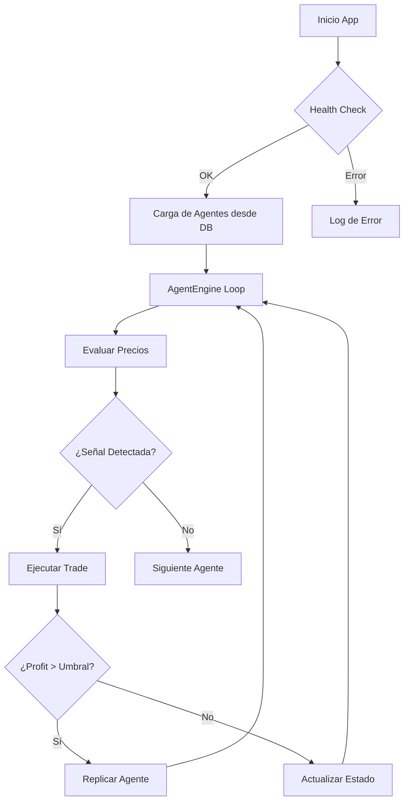

# 📊 Análisis Completo del Sistema: AUTOMATON v2

## 1. Resumen Ejecutivo
AUTOMATON v2 es una plataforma autónoma de trading algorítmico diseñada para operar en mercados de criptomonedas. El sistema se distingue por su capacidad de **auto-replicación**, donde agentes exitosos generan "hijos" con parámetros optimizados, creando un ecosistema evolutivo de trading.

## 2. Arquitectura Técnica

### 2.1 Backend (FastAPI + SQLModel)
El núcleo del sistema es un motor asíncrono desarrollado en Python que gestiona el ciclo de vida de los agentes.
- **Motor de Trading (`AgentEngine`)**: Evalúa señales cada 5-60 segundos.
- **Persistencia**: Migración completada de MongoDB a **SQLite** para mayor portabilidad y rendimiento en entornos locales.
- **Modelos**: Uso de `SQLModel` para asegurar tipos consistentes desde la DB hasta la API.

### 2.2 Frontend (React + Tailwind + Framer Motion)
Una interfaz de usuario de alta fidelidad con estética "Cyberpunk" que proporciona visibilidad total del orquestador.
- **Dashboard en Tiempo Real**: Visualización de métricas críticas mediante `recharts`.
- **Gestión de Agentes**: Control granular de cada entidad (Pausar, Reanudar, Eliminar).
- **Simulación**: Modo de prueba para validar estrategias sin riesgo de capital.

### 2.3 Desktop (Electron)
Empaqueta la solución como una aplicación nativa, permitiendo una experiencia de usuario fluida y acceso a recursos del sistema de forma segura.

## 3. Análisis de Estrategias

| Estrategia | Tipo | Lógica Principal | Perfil de Riesgo |
|------------|------|-------------------|------------------|
| **Alpha (S1)** | Momentum Rider | Compra en expansión de volatilidad direccional. | Moderado |
| **Beta (S2)** | Range Scalper | Reversión a la media en mercados laterales. | Bajo |
| **Gamma (S3)** | Breakout Hunter | Captura rupturas tras periodos de compresión. | Alto |

### Optimización Matemática
A diferencia de los enfoques tradicionales, AUTOMATON utiliza:
- **ATR (Average True Range)** para Stops dinámicos.
- **Scoring System**: Las entradas requieren un puntaje > umbral, no solo condiciones booleanas.
- **Filtro BTC**: Evita operar Altcoins si el mercado macro (BTC) está en modo "Risk-Off".

## 4. Visual Walkthrough (Módulos de la UI)

### 4.1 Dashboard Principal
El centro de mando. Muestra el P&L total, win rate, salud del sistema y la distribución de agentes por estado.

### 4.2 Centro de Agentes
Lista detallada de todos los agentes activos, sus balances, ROI y generación (G1, G2, etc.).

### 4.3 Análisis de Estrategias y Actividad
Gráficos de rendimiento por estrategia y métricas de ejecución.

---

## 5. Diagrama de Flujo del Sistema

## 6. Estado de Implementación
- [x] Migración SQLModel (100%)
- [x] UI Dashboard Cyberpunk (100%)
- [x] Motor de Replicación (100%)
- [ ] Conexión Real con Binance API (En progreso)
- [ ] Integración de LLM para Análisis de Sentimiento (Pendiente)
